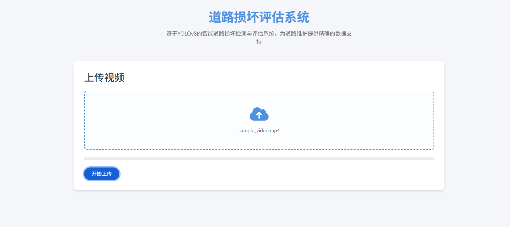
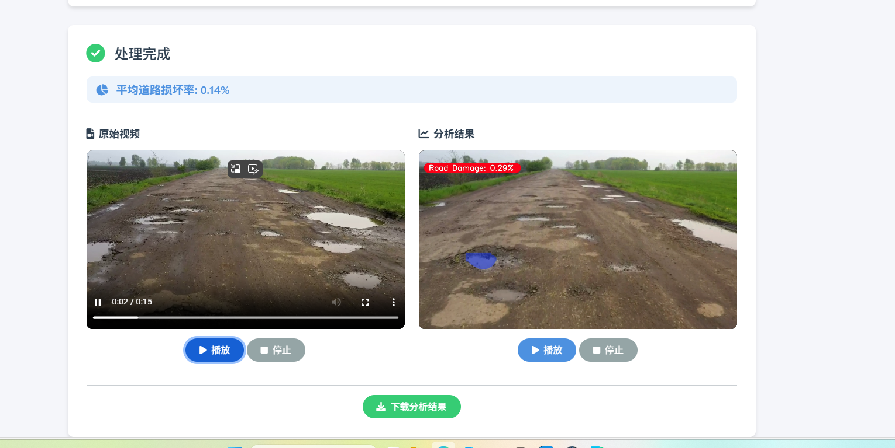

# 道路损坏评估系统

基于 YOLOv8 的智能道路损坏检测与评估系统，为道路维护提供精确的数据支持。

## 功能特点

- 支持视频上传和处理
- 实时道路损坏检测
- 自动计算道路损坏率
- 提供原始视频和处理后视频的对比展示
- 支持视频下载和分享

## 技术栈

- 后端：Python, Flask
- 前端：HTML, CSS, JavaScript, Bootstrap
- 深度学习：YOLOv8
- 视频处理：OpenCV

## 安装步骤

1. 克隆项目
```bash
git clone [项目地址]
cd YOLOv8_Pothole_Segmentation_Road_Damage_Assessment
```

2. 创建虚拟环境
```bash
python -m venv venv
source venv/bin/activate  # Linux/Mac
venv\Scripts\activate     # Windows
```

3. 安装依赖
```bash
pip install -r requirements.txt
```

4. 配置环境变量
```bash
# 创建 .env 文件并添加以下内容
FLASK_APP=run.py
FLASK_ENV=development
SECRET_KEY=your_secret_key
```

## 运行项目

1. 启动 Flask 应用
```bash
python run.py
```

2. 在浏览器中访问
```
http://localhost:5000
```

## 使用说明

1. 点击上传区域或拖放视频文件到指定区域
2. 等待视频上传和处理
3. 查看处理结果，包括：
   - 原始视频
   - 处理后的视频（带有损坏检测标记）
   - 道路损坏率统计
4. 可以下载处理后的视频

## 运行结果展示

### 登录界面


### 视频处理中


### 原始视频与处理后视频对比


### 损坏率统计


## 注意事项

- 支持的视频格式：MP4, AVI, MOV, WMV
- 建议上传的视频时长不超过 5 分钟
- 确保有足够的磁盘空间用于视频处理

## 常见问题

1. 视频上传失败
   - 检查文件格式是否支持
   - 确保文件大小不超过限制
   - 检查网络连接

2. 视频处理失败
   - 检查服务器资源是否充足
   - 确保模型文件存在且正确
   - 查看服务器日志获取详细错误信息

## 贡献指南

欢迎提交 Issue 和 Pull Request 来帮助改进项目。

## 许可证

[MIT License](LICENSE)